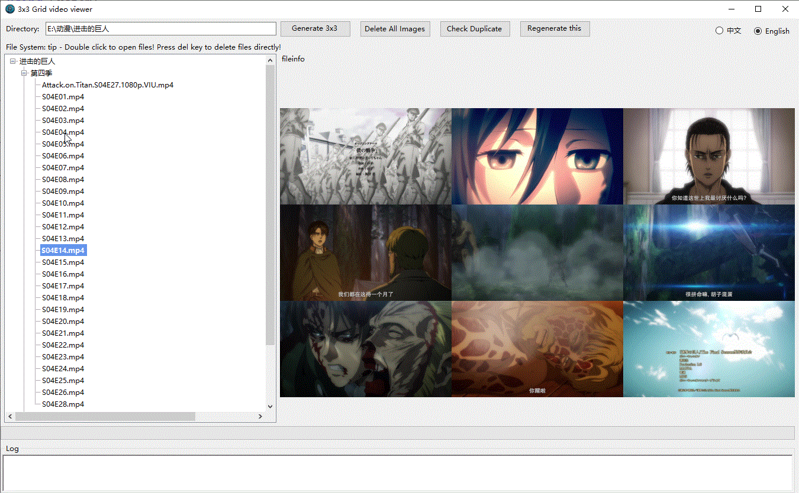

# DOIMAGE

九宫格图片查看器

## 功能特性
- 支持多种视频格式
- 九宫格布局展示
- 直接在视频同目录生成同名jpg九宫格图片
- 支持图片批量删除
- 支持简单判断重复视频

## 使用说明
1. 打开应用程序
2. 点击生成九宫格图片
3. 在文件列表单击就能看到九宫格图片了

## 开发环境
- .NET 8.0
- Windows Forms

## 构建
1. 克隆仓库
2. 使用Visual Studio打开解决方案
3. 构建并运行
